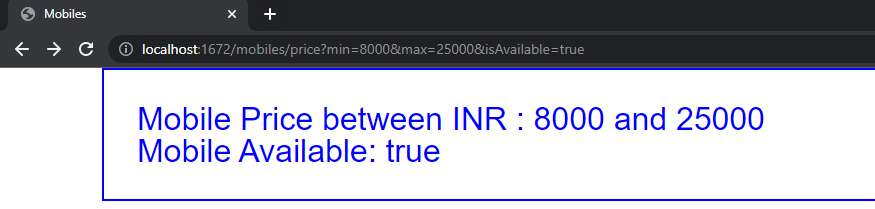

# data-transfer-client-server
This is a simple app which uses one of the data transferring methods in web which is
using Path Variables in the URI.

1. In this example I have a Controller which binds to method: http://localhost:PORT/books/{name}/{id}, It basically means
that the Client who is accessing the URI has to pass name and id as they are annotated with @PathVariable annotation so 
spring will treat them as Path-Variables and when we pass the data, it goes to the server and using the Model we can pass
that data to our View and display the data.

    Transferring data through path-variables is a method but we can only send small amount of data using this variables, Do
    not use more than 3 parameters. Yes we can use it so it directly can be appended with the URI and is a easy method and can 
    be viewed in the URI and when the value we pass is compulsory to be entered.

2. In the other method in Page Controller class I have a method which is let's say for instance going to give us 
   all the mobiles with specified price-range and also tell it is available or not.
   Now Clearly here we can see the change in the parameters that they are using @RequestParam annotation which
   is way of defining <b>Key-Value</b> based data in the URI 
   for e.g. in my case i used http://localhost:PORT/mobiles/price URI, there is a particular way in which we 
   define the request-parameters <i>(also called as query parameters)</i>.

  <b>?</b> In the path is the starting of the query-params and we can have multiple request-params in key-value
  fashion i.e. in this case min is key and 8000 is value so on Server it will be mapped in the same Key : Value way.
  In case of Multiple query-params we can use <i>&</i> symbol so to separate them.
  
      Again we can only send limited or only small amount of data with help of query-params and also
      adding too-much params will make path look confusing and complex to understand.
      But Query params need not to be mandatory, they can be optional values. So if user needs it
      they can add it or else it will be just null. Like if we do not require Availablity criteria then 
      we can simply remove the defination.